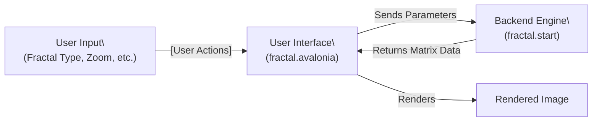

# Playing with Fractals

## Table of Contents

- [Introduction](#introduction)
- [More info on Fractals](#more-info-on-fractals)
  - [The Cartesian Plane and Iterations](#the-cartesian-plane-and-iterations)
  - [Going Deeply into Sets](#going-deeply-into-sets)
    - [Mandelbrot Set](#mandelbrot-set)
    - [Julia Set](#julia-set)
  - [Fractals in Nature and Science](#fractals-in-nature-and-science)
  - [Iteration, Zoom, and Infinite Detail](#iteration-zoom-and-infinite-detail)
  - [Coloring and Visualization](#coloring-and-visualization)
  - [Applications of Fractals](#applications-of-fractals)
  - [Further Reading](#further-reading)
- [This play set](#this-play-set)
  - [Output Quality and UI Responsiveness](#output-quality-and-ui-responsiveness)
  - [Saving Images and Description Files](#saving-images-and-description-files)
  - [Selecting the Fractal Type](#selecting-the-fractal-type)
  - [Zooming In and Out](#zooming-in-and-out)
  - [Adjusting Parameters Manually](#adjusting-parameters-manually)
  - [Color Wheels and Visualization](#color-wheels-and-visualization)
- [Compiling and Running this Code](#compiling-and-running-this-code)
  - [Prerequisites](#prerequisites)
  - [Reviewing the Launch Configuration](#reviewing-the-launch-configuration)
  - [Building and Running (Debug Mode)](#building-and-running-debug-mode)
- [Building and Running a Release Version](#building-and-running-a-release-version)
  - [Steps to Build and Run in Release Mode](#steps-to-build-and-run-in-release-mode)
  - [Why Release Mode is Faster](#why-release-mode-is-faster)
- ['Server'/Platform Independent Functions](#serverplatform-independent-functions)
- [Architecture: Backend and Frontend Responsibilities](#architecture-backend-and-frontend-responsibilities)
  - [Component Interaction Diagram](#component-interaction-diagram)

## Introduction

## More info on Fractals

Fractals are infinitely complex patterns that are self-similar across different scales. They are created by repeating a simple process over and over in an ongoing feedback loop. Driven by recursion, fractals are images of dynamic systems – the pictures of Chaos. Geometrically, they exist in between our familiar dimensions. Fractals are not just mathematical curiosities; they are found throughout nature, in coastlines, mountains, clouds, plants, and even in the branching of trees and blood vessels.

### The Cartesian Plane and Iterations

Fractals are often visualized on the Cartesian plane, where each point (x, y) is mapped to a complex number. The process of generating a fractal image involves iterating a mathematical function for each point on the plane and determining whether the sequence diverges or remains bounded. The number of iterations before divergence (or reaching a maximum) is used to assign a color to each point, creating the intricate patterns we see.

### Going Deeply into Sets

#### Mandelbrot Set

The Mandelbrot set is perhaps the most famous fractal. It is defined by iterating the function `z = z^2 + c`, where both z and c are complex numbers, and starting with z = 0. For each point c on the complex plane, the function is iterated repeatedly. If the magnitude of z remains bounded (does not go to infinity) after many iterations, the point is considered part of the Mandelbrot set and is colored accordingly. The boundary of the Mandelbrot set reveals an infinitely complex, self-similar structure.

#### Julia Set

Julia sets are closely related to the Mandelbrot set but differ in that the value of c is fixed and z starts at each point on the plane. The resulting patterns can be connected or disconnected, depending on the value of c. Julia sets can be thought of as slices through the parameter space of the Mandelbrot set, and exploring them reveals a vast variety of shapes and structures.

### Fractals in Nature and Science

Fractals are not just mathematical abstractions. They appear in natural phenomena such as snowflakes, mountain ranges, lightning bolts, and coastlines. Their self-similar structure makes them useful in computer graphics for generating realistic landscapes and textures. In science, fractals are used to model complex systems and processes, from the distribution of galaxies to the structure of lungs and blood vessels.

### Iteration, Zoom, and Infinite Detail

One of the most fascinating aspects of fractals is their infinite detail. No matter how much you zoom in, new patterns emerge, often resembling the whole. This property is called self-similarity. The process of zooming into a fractal is not just visually stunning but also mathematically profound, revealing the endless complexity hidden within simple equations.

### Coloring and Visualization

The beauty of fractals is often enhanced by coloring algorithms. By mapping the number of iterations to a color palette, intricate and vibrant images are produced. Different coloring techniques can highlight various features of the fractal, such as its boundary or interior structure. Experimenting with color wheels and palettes is an essential part of fractal exploration.

### Applications of Fractals

Fractals have practical applications in many fields, including computer graphics, signal and image compression, antenna design, and even medicine. Their ability to describe complex, irregular shapes makes them invaluable tools for scientists and engineers.

### Further Reading

- Benoit Mandelbrot, "The Fractal Geometry of Nature"
- Heinz-Otto Peitgen, Dietmar Saupe, "The Science of Fractal Images"
- Michael Barnsley, "Fractals Everywhere"

## This play set

### Output Quality and UI Responsiveness

The **OutputQuality** setting has a significant impact on the responsiveness of the UI and the speed at which fractal images are generated:

- **Fast** and **Medium** quality settings produce images quickly, allowing for smooth navigation and rapid exploration of fractals. These are recommended for slower machines or when you want to quickly zoom and pan through the fractal space.
- **High** and **Extreme** quality settings generate more detailed and visually rich images, but require much more processing time. Even on fast machines, rendering at these levels can take several seconds or more, especially at high zoom levels or with large image sizes.

**Tips:**

- On slower computers, use Fast or Medium quality to navigate, then switch to a higher quality for your final image.
- On powerful hardware, you can use higher quality settings more often, but expect some delay at the most detailed levels.

In general, increasing OutputQuality increases the number of iterations and the resolution of the image, which directly affects how long it takes to process and display the fractal.

### Saving Images and Description Files

When you save a fractal image from the application, a JSON description file is created alongside the image file. This JSON file has the same filename as the image, but with a `.json` extension (for example, `fractal-image.png` and `fractal-image.png.json`).

The description file contains all the parameters used to generate the image, such as fractal type, zoom level, position, color settings, and OutputQuality. You can use this file to return to the exact same view later, share your fractal setup with others, or automate the regeneration of images with the same parameters.

**How to use:**

- To revisit a saved fractal, simply load the corresponding JSON file in the application. The UI will update to match the saved parameters, allowing you to continue exploring or export the image again.

This application provides an interactive UI for exploring fractals. Here’s how to use it:

### Selecting the Fractal Type

Upon launching the application, you will see options to select the type of fractal you want to explore, such as Mandelbrot or Julia. Use the dropdown or selection menu in the UI to choose your desired fractal set. The display will update to show the selected fractal.

### Zooming In and Out

- **Zoom In:** Left-click anywhere on the fractal image to zoom in at that point. Each click increases the magnification, revealing more detail.
- **Zoom Out:** Right-click to zoom out, allowing you to see a broader view of the fractal.

### Adjusting Parameters Manually

You can also fine-tune the fractal by entering values directly into the parameter fields in the UI. These fields may include zoom level, position (X/Y), iteration count, and color settings. After adjusting the numbers, press Enter or click the update button to refresh the image with the new parameters.

### Color Wheels and Visualization

Experiment with different color wheels to change the appearance of the fractal. Select a color palette from the UI to see how it affects the visualization. This can highlight different features and make the fractal exploration more engaging.

### Compiling and Running this Code

#### Prerequisites

1. **Install Visual Studio Code (VSCode):**

    - Download and install VSCode from [https://code.visualstudio.com/](https://code.visualstudio.com/)

2. **Install .NET SDK:**

    - Download and install the latest .NET SDK (version 9.0 or later) from [https://dotnet.microsoft.com/download](https://dotnet.microsoft.com/download)
    - Verify installation by running `dotnet --version` in your terminal.

3. **Clone this Repository:**

    - Open a terminal and run:

    ```bash
    git clone https://github.com/trevorfrewin/fractals.git
    cd fractals
    ```

4. **Open the Project in VSCode:**

    - Launch VSCode and open the `fractals` folder.

5. **Install Recommended Extensions:**

    - When prompted, install the C# extension (by Microsoft) and any other recommended extensions for .NET development.

#### Reviewing the Launch Configuration

1. In VSCode, open the `.vscode/launch.json` file (if present) to review or customize the debug and run configurations.
2. Ensure the launch configuration points to the correct project (e.g., `tfrewin.play.fractal.avalonia` for the UI).
3. You can start debugging by pressing `F5` or selecting "Run and Debug" from the sidebar.

#### Building and Running (Debug Mode)

1. Open the integrated terminal in VSCode.
2. Build the project:

    ```bash
    dotnet build tfrewin.play.fractal.avalonia/tfrewin.play.fractal.avalonia.csproj
    ```

3. Run the application:

    ```bash
    dotnet run --project tfrewin.play.fractal.avalonia/tfrewin.play.fractal.avalonia.csproj
    ```

## Building and Running a Release Version

For best performance, especially when rendering large or complex fractals, it is recommended to build and run the application in Release mode. Release builds enable compiler optimizations that make the code run significantly faster compared to Debug mode.

### Steps to Build and Run in Release Mode

1. Build the Release version:

    ```bash
    dotnet build -c Release tfrewin.play.fractal.avalonia/tfrewin.play.fractal.avalonia.csproj
    ```

2. Run the Release build:

    ```bash
    dotnet run -c Release --project tfrewin.play.fractal.avalonia/tfrewin.play.fractal.avalonia.csproj
    ```

3. Alternatively, you can publish a self-contained Release build:

    ```bash
    dotnet publish -c Release tfrewin.play.fractal.avalonia/tfrewin.play.fractal.avalonia.csproj
    ```

    The output will be in the `bin/Release/net9.0/publish/` directory.

### Why Release Mode is Faster

Release mode enables advanced compiler optimizations, removes debugging symbols, and streamlines the code for execution speed. This is especially important for fractal rendering, which can be computationally intensive. Running in Release mode ensures smoother interaction and faster image generation, making your fractal exploration experience much more enjoyable.

### 'Server'/Platform Independent Functions

The platform-independent backend processing includes command-line access to generating images from the Matrix. This allows you to script fractal generation or integrate it into other workflows.

### Architecture: Backend and Frontend Responsibilities

This project is split into two main components:

- **Backend (`tfrewin.play.fractal.start`)**: Responsible for all fractal calculations, matrix generation, and core logic. It exposes methods to generate fractal data (such as Mandelbrot or Julia sets) based on parameters provided by the frontend. The backend is platform-independent and can be used in headless or automated scenarios.

- **Frontend (`tfrewin.play.fractal.avalonia`)**: Provides the interactive user interface, allowing users to select fractal types, zoom, adjust parameters, and visualize the results. The frontend communicates with the backend to request fractal data and then renders the resulting images for the user. It is built with Avalonia for cross-platform desktop support.

#### Component Interaction Diagram



**Summary:**

- The frontend collects user input and displays images.
- The backend performs all heavy computation and returns data to the frontend.
- This separation allows for flexible use, testing, and future expansion (e.g., web or CLI frontends).
